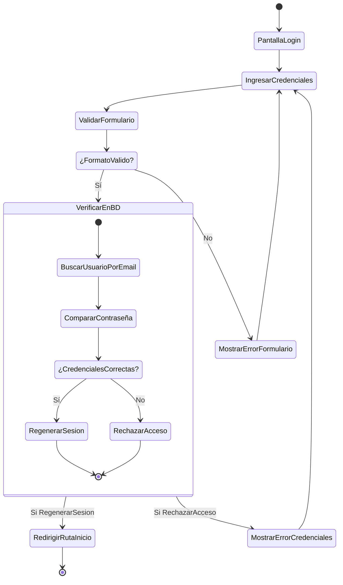

# Diagrama de Actividades: Autenticación (Login)

```mermaid
stateDiagram-v2
    [*] --> PantallaLogin
    PantallaLogin --> IngresarCredenciales
    IngresarCredenciales --> ValidarFormulario
    
    ValidarFormulario --> ¿FormatoValido?
    ¿FormatoValido? --> VerificarEnBD : Sí
    ¿FormatoValido? --> MostrarErrorFormulario : No
    
    MostrarErrorFormulario --> IngresarCredenciales
    
    state VerificarEnBD {
        [*] --> BuscarUsuarioPorEmail
        BuscarUsuarioPorEmail --> CompararContraseña
        CompararContraseña --> ¿CredencialesCorrectas?
        ¿CredencialesCorrectas? --> RegenerarSesion : Sí
        ¿CredencialesCorrectas? --> RechazarAcceso : No
        RegenerarSesion --> [*]
        RechazarAcceso --> [*]
    }
    
    VerificarEnBD --> RedirigirRutaInicio : Si RegenerarSesion
    VerificarEnBD --> MostrarErrorCredenciales : Si RechazarAcceso
    
    MostrarErrorCredenciales --> IngresarCredenciales
    RedirigirRutaInicio --> [*]
```
