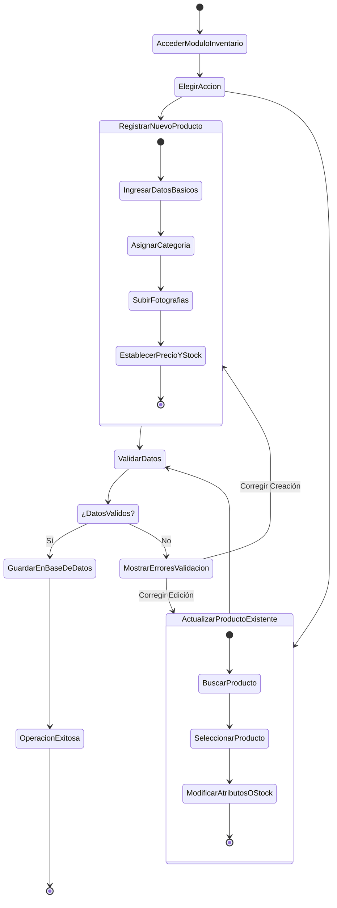

# Diagrama de Actividades: Gestión de Inventario

```mermaid
stateDiagram-v2
    [*] --> AccederModuloInventario
    AccederModuloInventario --> ElegirAccion
    
    ElegirAccion --> RegistrarNuevoProducto
    ElegirAccion --> ActualizarProductoExistente
    
    state RegistrarNuevoProducto {
        [*] --> IngresarDatosBasicos
        IngresarDatosBasicos --> AsignarCategoria
        AsignarCategoria --> SubirFotografias
        SubirFotografias --> EstablecerPrecioYStock
        EstablecerPrecioYStock --> [*]
    }
    
    state ActualizarProductoExistente {
        [*] --> BuscarProducto
        BuscarProducto --> SeleccionarProducto
        SeleccionarProducto --> ModificarAtributosOStock
        ModificarAtributosOStock --> [*]
    }
    
    RegistrarNuevoProducto --> ValidarDatos
    ActualizarProductoExistente --> ValidarDatos
    
    ValidarDatos --> ¿DatosValidos?
    ¿DatosValidos? --> GuardarEnBaseDeDatos : Sí
    ¿DatosValidos? --> MostrarErroresValidacion : No
    
    MostrarErroresValidacion --> RegistrarNuevoProducto : Corregir Creación
    MostrarErroresValidacion --> ActualizarProductoExistente : Corregir Edición
    
    GuardarEnBaseDeDatos --> OperacionExitosa
    OperacionExitosa --> [*]
```
