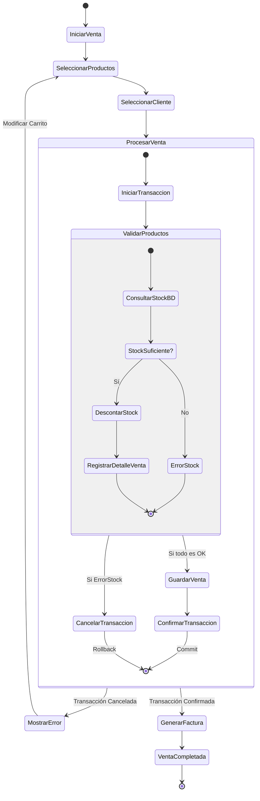

# Diagrama de Actividades: Registro de Venta

```mermaid
stateDiagram-v2
    [*] --> IniciarVenta
    IniciarVenta --> SeleccionarProductos
    SeleccionarProductos --> SeleccionarCliente
    SeleccionarCliente --> ProcesarVenta
    
    state ProcesarVenta {
        [*] --> IniciarTransaccion
        IniciarTransaccion --> ValidarProductos
        
        state ValidarProductos {
            [*] --> ConsultarStockBD
            ConsultarStockBD --> StockSuficiente?
            StockSuficiente? --> DescontarStock : Sí
            StockSuficiente? --> ErrorStock : No
            DescontarStock --> RegistrarDetalleVenta
            RegistrarDetalleVenta --> [*]
            ErrorStock --> [*]
        }
        
        ValidarProductos --> CancelarTransaccion : Si ErrorStock
        CancelarTransaccion --> [*] : Rollback
        
        ValidarProductos --> GuardarVenta : Si todo es OK
        GuardarVenta --> ConfirmarTransaccion
        ConfirmarTransaccion --> [*] : Commit
    }
    
    ProcesarVenta --> MostrarError : Transacción Cancelada
    MostrarError --> SeleccionarProductos : Modificar Carrito
    
    ProcesarVenta --> GenerarFactura : Transacción Confirmada
    GenerarFactura --> VentaCompletada
    VentaCompletada --> [*]
```
