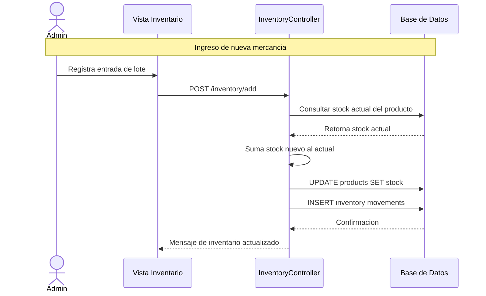

```mermaid
sequenceDiagram
    actor Admin
    participant Vista as Vista Inventario
    participant Controller as InventoryController
    participant DB as Base de Datos

    Note over Admin, DB: Ingreso de nueva mercancia
    Admin->>Vista: Registra entrada de lote
    Vista->>Controller: POST /inventory/add
    Controller->>DB: Consultar stock actual del producto
    DB-->>Controller: Retorna stock actual
    Controller->>Controller: Suma stock nuevo al actual
    Controller->>DB: UPDATE products SET stock
    Controller->>DB: INSERT inventory movements
    DB-->>Controller: Confirmacion
    Controller-->>Vista: Mensaje de inventario actualizado
```
