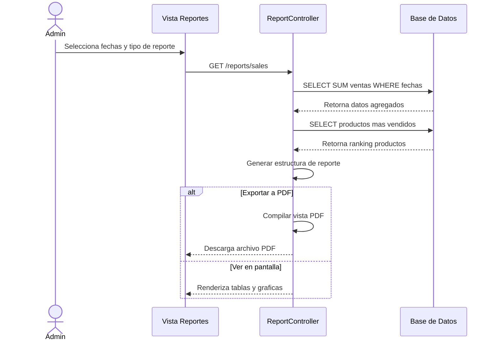

```mermaid
sequenceDiagram
    actor Admin
    participant Vista as Vista Reportes
    participant Controller as ReportController
    participant DB as Base de Datos
    
    Admin->>Vista: Selecciona fechas y tipo de reporte
    Vista->>Controller: GET /reports/sales
    Controller->>DB: SELECT SUM ventas WHERE fechas
    DB-->>Controller: Retorna datos agregados
    
    Controller->>DB: SELECT productos mas vendidos
    DB-->>Controller: Retorna ranking productos
    
    Controller->>Controller: Generar estructura de reporte
    
    alt Exportar a PDF
        Controller->>Controller: Compilar vista PDF
        Controller-->>Vista: Descarga archivo PDF
    else Ver en pantalla
        Controller-->>Vista: Renderiza tablas y graficas
    end
```
