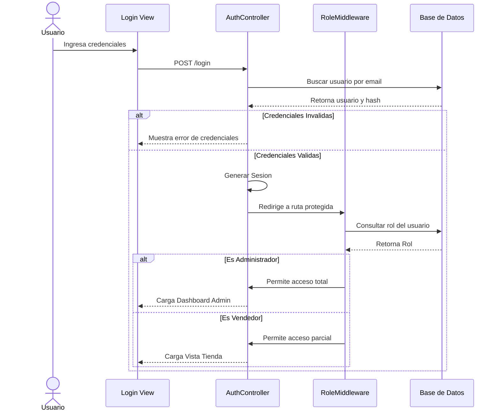

```mermaid
sequenceDiagram
    actor Usuario
    participant Vista as Login View
    participant Controller as AuthController
    participant Middleware as RoleMiddleware
    participant DB as Base de Datos

    Usuario->>Vista: Ingresa credenciales
    Vista->>Controller: POST /login
    Controller->>DB: Buscar usuario por email
    DB-->>Controller: Retorna usuario y hash
    
    alt Credenciales Invalidas
        Controller-->>Vista: Muestra error de credenciales
    else Credenciales Validas
        Controller->>Controller: Generar Sesion
        Controller->>Middleware: Redirige a ruta protegida
        Middleware->>DB: Consultar rol del usuario
        DB-->>Middleware: Retorna Rol
        
        alt Es Administrador
            Middleware->>Controller: Permite acceso total
            Controller-->>Vista: Carga Dashboard Admin
        else Es Vendedor
            Middleware->>Controller: Permite acceso parcial
            Controller-->>Vista: Carga Vista Tienda
        end
    end
```
