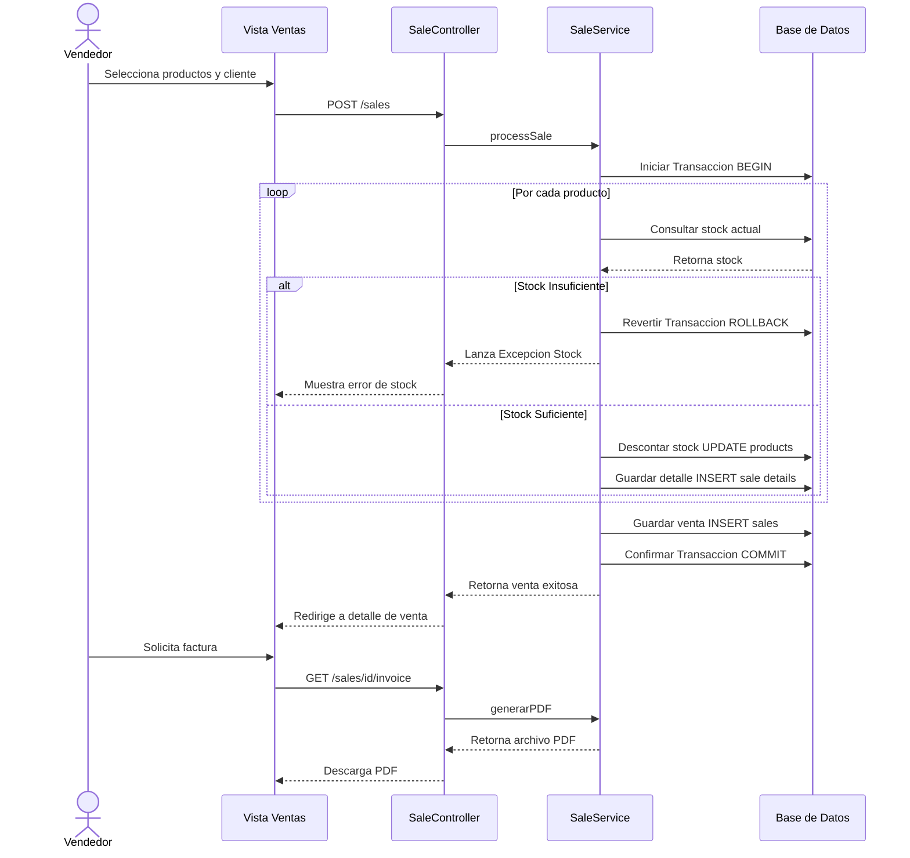

```mermaid
sequenceDiagram
    actor Vendedor
    participant Vista as Vista Ventas
    participant Controller as SaleController
    participant Service as SaleService
    participant DB as Base de Datos

    Vendedor->>Vista: Selecciona productos y cliente
    Vista->>Controller: POST /sales
    Controller->>Service: processSale
    Service->>DB: Iniciar Transaccion BEGIN
    
    loop Por cada producto
        Service->>DB: Consultar stock actual
        DB-->>Service: Retorna stock
        alt Stock Insuficiente
            Service->>DB: Revertir Transaccion ROLLBACK
            Service-->>Controller: Lanza Excepcion Stock
            Controller-->>Vista: Muestra error de stock
        else Stock Suficiente
            Service->>DB: Descontar stock UPDATE products
            Service->>DB: Guardar detalle INSERT sale details
        end
    end
    
    Service->>DB: Guardar venta INSERT sales
    Service->>DB: Confirmar Transaccion COMMIT
    Service-->>Controller: Retorna venta exitosa
    Controller-->>Vista: Redirige a detalle de venta
    Vendedor->>Vista: Solicita factura
    Vista->>Controller: GET /sales/id/invoice
    Controller->>Service: generarPDF
    Service-->>Controller: Retorna archivo PDF
    Controller-->>Vista: Descarga PDF
```
